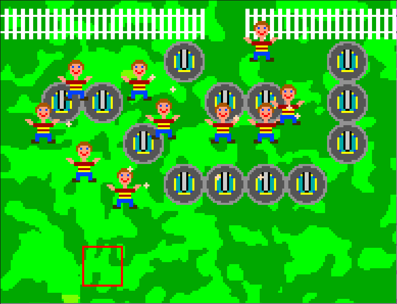

# GET OFF MY LAWN: The Game

This is a DOS game inspired by the [GET OFF MY LAWN][goml] YouTube
channel, which is dedicate to showcasing old games. The host, James, has
played my previous DOS games, so I thought I'd make one especially for
him.

## Instructions

This is a (terrible) tower defense game. Your job is to place turrets on
the lawn to take out those youngsters who won't stop going on about how
much they love modern games, especially *Mass Effect 3*. They're coming
for James in the bottom-middle of the screen. Don't let them touch him
or it's game over!

Use the **arrow keys** to move the cursor around the lawn and press
**SPACEBAR** to place a turret. You get **two turrets** to start, and
one additional turret each time you clear a brat off the lawn. You are
not allowed to place turrets in such a way that they block access to
James — though, *hint hint*, there are still ways to trap invaders.

`lawn.conf` has a suggested DOSBox configuration:

    dosbox -conf lawn.conf lawn.exe

## Caveats

I set a deadline for myself of one day, so the results are pretty crude.
There's not much of a game here. My wife helped by composing the music
and creating some of the art. It's not possible to win, only to delay
your inevitable loss.

## License

I dedicate everything to the public domain except for James's likeness,
which I stole from one of his videos.

[goml]: https://www.youtube.com/channel/UCCj_mkYyeGIb9MPSdb74ykA
